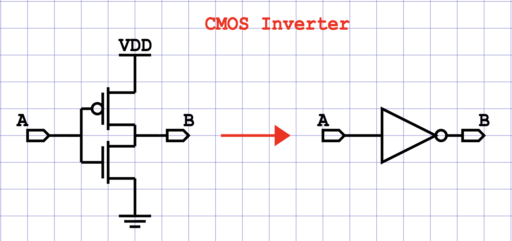

# FidoCadJS

<div align="center">


**A browser-based electronic schematic editor fully compatible with the FidoCad (fdc) format.**

[🌐 FidoCadJS](https://dantecpp.github.io/FidoCadJS/) • [📖 Source](https://github.com/DanteCpp/FidoCadJS) • [🐛 Report Bug](https://github.com/DanteCpp/FidoCadJS/issues) • [📺 FidoCadJ](https://fidocadj.github.io/FidoCadJ/index.html)

</div>

---

## Table of Contents

- [Getting Started](#getting-started)
  - [Quick Start](#quick-start)
  - [Keyboard Shortcuts](#keyboard-shortcuts)
  - [Example](#example)
- [About FidoCadJS](#about-fidocadjs)
  - [What is FidoCadJS?](#what-is-fidocadjs)
  - [A Bit of History](#a-bit-of-history)
  - [Key Features](#key-features)
  - [Community Libraries](#community-libraries)
  - [Supported Platforms](#supported-platforms)
  - [Differences from FidoCadJ (Java)](#differences-from-fidocadj-java)
  - [Roadmap](#roadmap)
- [For Developers](#for-developers)
  - [Repository Structure](#repository-structure)
  - [Development Server](#development-server)
  - [Project Architecture](#project-architecture)
  - [Building from Source](#building-from-source)
  - [Scripts Reference](#scripts-reference)
  - [Testing](#testing)
  - [Coding Conventions](#coding-conventions)
- [Contributing](#contributing)
- [Support](#support)
- [Acknowledgments](#acknowledgments)
- [License](#license)

---

## Getting Started

### Quick Start

1. Open [FidoCadJS](https://dantecpp.github.io/FidoCadJS/)
2. Select a component from the library panel on the right
3. Click on the canvas to place it
4. Draw connections with the Line tool (shortcut: `L`)
5. Save your schematic as an `.fcd` file

### Keyboard Shortcuts

| Key | Action | Key | Action |
|-----|--------|-----|--------|
| `A` / `Space` | Select tool | `L` | Line tool |
| `T` | Text tool | `B` | Bezier tool |
| `P` | Polygon tool | `O` | Complex curve |
| `E` | Ellipse tool | `G` | Rectangle tool |
| `C` | Connection dot | `I` | PCB line |
| `Z` | PCB pad | `R` | Rotate selected |
| `S` | Mirror selected | `Ctrl+Z` | Undo |
| `Ctrl+Y` | Redo | `Ctrl+C/V/X` | Clipboard |
| `Delete` | Delete selected | `Escape` | Deselect / exit tool |
| `Alt+arrows` | Nudge 1px | `+`/`-` | Zoom in/out |

### Example

A CMOS inverter drawn with FidoCadJS. Copy the `fcd` code bellow, paste it into the FidoCadJS canva, and start editing!

```
[FIDOCAD]
LI 55 45 60 45 0
LI 45 40 45 50 0
LI 55 35 55 30 0
LI 52 30 58 30 0
LI 40 45 45 45 0
LI 71 45 84 45 2
FCJ 2 0 3 2 0 0
TY 52 27 4 2 0 1 0 * VDD
TY 33 41 4 2 0 1 0 * A
TY 64 41 4 2 0 1 0 * B
TY 89 41 4 2 0 1 0 * A
TY 119 41 4 2 0 1 0 * B
TY 68 23 4 2 0 1 2 * CMOS Inverter
MC 95 45 0 0 680
MC 55 55 0 0 040
MC 115 45 0 0 ey_libraries.refpnt2
MC 90 45 0 0 ey_libraries.refpnt3
MC 50 40 0 0 ey_libraries.trnmos2
MC 50 50 0 0 ey_libraries.trnmos3
MC 35 45 0 0 ey_libraries.refpnt3
MC 60 45 0 0 ey_libraries.refpnt2
```



---

## About FidoCadJS

### What is FidoCadJS?

FidoCadJS is a **TypeScript browser port** of [FidoCadJ](https://github.com/FidoCadJ/FidoCadJ), the multiplatform electronic schematic and PCB layout editor. It runs entirely in your web browser; no installation, no Java runtime, no downloads. Just open the page and start drawing.

It supports the full FidoCad/FidoCadJ file format (`.fcd`), so any schematic you already have works immediately. FidoCadJS saves and loads files using the compact text format that made FidoCad popular on Italian Usenet and forums.

**Zero runtime dependencies.** The entire application is built on browser APIs: Canvas 2D, localStorage, the Fetch API, and the Clipboard API. There are no server-side components; it's all client-side, so your drawings never leave your machine.

### A Bit of History

The story begins in the late 1990s, in the Italian newsgroup **it.hobby.elettronica**. Lorenzo Lutti created **FidoCad per Windows**, a small, fast vector drawing program using a compact text-based file format. The format was ingenious: a schematic could be represented entirely as printable ASCII text, small enough to paste directly into a Usenet message. This made it perfect for sharing circuit designs in discussion groups.

FidoCad for Windows gained widespread adoption in the Italian electronics community. The program was last updated in 2001, but the format lived on.

In 2007, **Davide Bucci** ([DarwinNE](https://github.com/DarwinNE)) found himself without a way to use FidoCad on macOS and Linux. Rather than complain, he reverse-engineered the FidoCad format, first writing **FidoReadJ** (a Java applet for viewing FidoCad drawings in a web page), then in 2008 completing **FidoCadJ**; a full-featured editor written in Java. FidoCadJ brought anti-aliased graphics, internationalization (10+ languages), advanced export (PDF, EPS, SVG, PGF for LaTeX, PNG, JPG), more community libraries, and active development. It even gained an Android port and runs on Windows, macOS, Linux, and Android.

For a deeper dive into the project's history, see Davide Bucci's article (in italian) at [ElectroYou](https://www.electroyou.it/darwinne/wiki/fidocadj).

### Key Features

- **Drawing primitives** — 11 graphic types: line, rectangle, ellipse, polygon, Bézier, complex curve, PCB line, PCB pad, connection dot, advanced text, and macro.
- **Full FCL/FCD file format** — read and write the FidoCad/FidoCadJ text format with macro expansion (max recursion depth 16) and safety limits.
- **Editor UX** — multi-layer canvas, snap-to-grid, full undo/redo, multi-selection, in-place text editing, context menu, ghost previews for polygon/curve/Bezier, document-level Escape to cancel any operation, "symbolize" action to turn selections into reusable macros.
- **Component libraries** — bundled standard FCL libraries plus a user library that persists in `localStorage`.
- **Export** — SVG export today (`src/export/ExportSVG.ts`), with the abstraction in place for additional formats.
- **I18n** — locale framework (`src/i18n/`); English ships now, additional bundles drop in as JSON.
- **Persistent settings** — preferences and the user library survive page reloads via `localStorage`.
- **Zero runtime dependencies** — pure browser APIs (Canvas 2D, localStorage, Fetch, Clipboard); the build ships as static files.

### Community Libraries

FidoCadJS bundles the standard FidoCadJ libraries under `public/lib/`:

| Library | File | Contents |
|---------|------|----------|
| Standard library | `FCDstdlib_en.fcl` | Original FidoCad standard symbols (resistors, capacitors, ICs, ...) |
| Electrotechnics | `elettrotecnica_en.fcl` | Power and electrotechnical symbols |
| EY Libraries | `EY_Libraries.fcl` | ElectroYou community symbols |
| IHRAM | `IHRAM_en.fcl` | Specialty / amateur radio symbols |
| PCB | `PCB_en.fcl` | PCB footprints and pads |

Users can also load additional `.fcl` files into the User Library from the macro picker; these persist across reloads in `localStorage`.

### Supported Platforms

FidoCadJS runs in any modern browser with Canvas 2D and ES2022 support. There is no installation, no Java runtime, and no OS-specific build; the same static bundle works on every platform.

| Browser | Minimum version |
|---------|-----------------|
| Chrome  | 105 |
| Firefox | 102 |
| Safari | 15.4 |

It works on desktop, tablet, and mobile; pointer events are handled uniformly so touch and mouse input behave the same.

### Differences from FidoCadJ (Java)

FidoCadJS targets feature parity with FidoCadJ for editing and `.fcd` interoperability, but a few things from the Java upstream are not (yet) ported:

- **Export formats** — SVG only at the moment. PDF, EPS, PGF/TikZ for LaTeX, PNG and JPG export from FidoCadJ are not implemented.
- **Locales** — the i18n framework is in place but currently only the English bundle ships. FidoCadJ has 10+ translations.
- **Platform integrations** — there is no Android-specific build; the browser version covers mobile via touch events.
- **Print** — native print dialog is delegated to the browser's built-in print.
- **LaTeX** - $\LaTeX$ parsing and rendering has not been implemented yet. 

If you need any of the missing pieces, FidoCadJ remains fully supported and can read/write the same `.fcd` files.

### Roadmap

The project is currently at a **beta** release. Editing, parsing, and SVG export are stable and covered by tests; the FCL round-trip is validated for all 11 primitive types. Work in progress includes additional export formats, more locale bundles, and broader feature coverage versus FidoCadJ. Bug reports and pull requests are welcome (see [Contributing](#contributing)).

---

## For Developers

### Repository Structure

```
FidoCadJS/
    ├── index.html           # Entry HTML
    ├── vite.config.ts       # Vite build configuration
    ├── tsconfig.json        # Strict TypeScript configuration
    ├── package.json         # Dependencies and scripts
    ├── src/
    │   ├── app.ts           # Application entry point & UI bootstrap
    │   ├── circuit/         # Editor core (MVC)
    │   │   ├── model/       #   DrawingModel, layers
    │   │   ├── controllers/ #   Parser, Editor, Selection, AddElements
    │   │   └── views/       #   Drawing, Export
    │   ├── primitives/      # 11 graphic primitive types
    │   ├── librarymodel/    # Component library system
    │   ├── export/          # SVG export
    │   ├── graphic/         # Canvas graphics abstraction layer
    │   ├── geom/            # Coordinate mapping, geometry
    │   ├── layers/          # Layer definitions
    │   ├── macropicker/     # Library tree browser
    │   ├── ui/              # Dialogs, menus, context menu
    │   ├── undo/            # Undo/redo manager
    │   ├── settings/        # Persisted settings
    │   ├── i18n/            # Internationalization
    │   └── globals/         # Constants and utilities
    ├── test/                # Vitest test suite
    └── public/
        ├── lib/             # Standard FCL libraries
        ├── icons/           # Toolbar and app icons
        └── img/             # Screenshots
```

### Development Server

```bash
git clone https://github.com/DanteCpp/FidoCadJS.git
cd FidoCadJS
npm install
npm run dev
```

Open `http://localhost:5173/FidoCadJS/` in your browser.

### Project Architecture

FidoCadJS follows a clean MVC architecture:

- **Model** — `DrawingModel` holds primitives, layers, and macro library state
- **View** — HTML Canvas rendering via the `GraphicsInterface` abstraction; `Drawing` handles per-layer rendering
- **Controller** — `CircuitPanel` coordinates mouse/keyboard input, `ElementsEdtActions` dispatches tool-specific handlers, `UndoManager` tracks full-state snapshots

The FCL parser (`ParserActions`) handles the text-based `.fcd` format with safety limits and macro expansion (max depth 16).

### Building from Source

#### Prerequisites

- Node.js 22+
- npm

#### Build Commands

```bash
npm run build        # Type-check + Vite production build
npm run typecheck    # TypeScript type checking only (tsc --noEmit)
npm run dev          # Start Vite dev server with HMR
npm run preview      # Preview production build
```

#### Production Build

Output goes to `dist/`. The build target is ES2022, with full sourcemaps.

```bash
npm run build
```

### Scripts Reference

| Command | Description |
|---------|-------------|
| `npm run dev` | Start Vite dev server with Hot Module Replacement |
| `npm run build` | `tsc` + Vite production build |
| `npm run preview` | Preview the production build locally |
| `npm test` | Run Vitest in watch mode |
| `npm run test:run` | Run Vitest once |
| `npm run typecheck` | TypeScript type checking (`tsc --noEmit`) |

### Testing

FidoCadJS uses **Vitest** with **jsdom** for a browser-like test environment. Tests are in `test/**/*.test.ts`.

**Run all tests:**
```bash
npm run test:run
```

**Current test suites:**
| Test | What it validates |
|------|-------------------|
| `test/parser/primitive-round-trip.test.ts` | FCL format: all 11 primitive types survive parse→serialize→parse with identical output |
| `test/circuit/model/drawing-model.test.ts` | DrawingModel construction, primitive manipulation, dirty flag |
| `test/circuit/controllers/add-elements.test.ts` | Creating all primitive types via tool handlers |
| `test/circuit/controllers/selection-actions.test.ts` | Selection queries, multi-select, get-text |
| `test/export/export-svg.test.ts` | SVG export produces correct XML for all primitive types |
| `test/geom/map-coordinates.test.ts` | Coordinate system mapping, zoom, orientation, snap |
| `test/undo/undo-manager.test.ts` | Undo/redo stack, eviction, library state |
| `test/globals/globals.test.ts` | Path/extension utilities, coordinate parsing |
| `test/layers/layer-desc.test.ts` | Layer model, StandardLayers |
| `test/librarymodel/library-model.test.ts` | Library hierarchy, CRUD, events |

### Coding Conventions

- ✅ **Language:** TypeScript 5.4 with strict mode enabled
- ✅ **Indentation:** 4 spaces (no tabs)
- ✅ **Naming:** `PascalCase` for classes, `camelCase` for methods/variables
- ✅ **Imports:** Explicit `.js` extensions in import paths (ESM)
- ✅ **Null safety:** `strictNullChecks`, `exactOptionalPropertyTypes`
- ✅ **No unused code:** `noUnusedLocals`, `noUnusedParameters`, `noImplicitReturns`
- ✅ **TypeScript config:** `@/` path alias maps to `./src/`
- ✅ **File headers:** Every file includes a header block with filename, author, date, and description

---

## Contributing

Contributions are welcome! Whether it's bug fixes, new features, translations, or documentation improvements.

1. 🍴 Fork the repository
2. 🌿 Create a feature branch
3. 🔨 Make your changes following the coding conventions
4. ✅ Run `npm run typecheck` and `npm run test:run`
5. 📬 Submit a pull request

**Before submitting:**
- [ ] Follows coding conventions
- [ ] Code compiles (`npm run typecheck`)
- [ ] All tests pass (`npm run test:run`)
- [ ] Build succeeds (`npm run build`)

---

## Support

- 📖 **Documentation:** See the original [FidoCadJ manual](https://github.com/DarwinNE/FidoCadJ/releases) for usage instructions (the user interface is similar)
- 🐛 **Bug Reports:** [GitHub Issues](https://github.com/DanteCpp/FidoCadJS/issues)
- 💬 **Discussions:** Open a GitHub Discussion for questions and ideas

---

## Acknowledgments

### Original FidoCad

- **Lorenzo Lutti** for creating the original FidoCad for Windows and its brilliant text-based file format. Without his work, none of this would exist.

### FidoCadJ (Java)

- **Davide Bucci** ([DarwinNE](https://github.com/DarwinNE)) — Original author of FidoCadJ, for his reverse-engineering of the FidoCad format, the complete Java implementation, and years of continued development
- All contributors, beta testers, translators, and library editors listed in the [FidoCadJ README](https://github.com/FidoCadJ/FidoCadJ)

### Icons

- Toolbar icons from [Pictogrammers](https://pictogrammers.com/libraries/)

---

## License

FidoCadJS is free software licensed under **GNU General Public License v3**:

```
FidoCadJS is free software: you can redistribute it and/or modify
it under the terms of the GNU General Public License as published by
the Free Software Foundation, either version 3 of the License, or
(at your option) any later version.

FidoCadJS is distributed in the hope that it will be useful,
but WITHOUT ANY WARRANTY; without even the implied warranty of
MERCHANTABILITY or FITNESS FOR A PARTICULAR PURPOSE. See the
GNU General Public License for more details.
```

You should have received a copy of the GNU General Public License along with FidoCadJS.  
If not, see <http://www.gnu.org/licenses/>.

---

<div align="center">

**Copyright © 2026 Dante Loi**

⭐ If you find this project useful, please consider starring the repository!

[🌐 FidoCadJS](https://dantecpp.github.io/FidoCadJS/) • [📖 Source](https://github.com/DanteCpp/FidoCadJS) • [🐛 Report Bug](https://github.com/DanteCpp/FidoCadJS/issues) • [📺 FidoCadJ](https://fidocadj.github.io/FidoCadJ/index.html)

</div>
